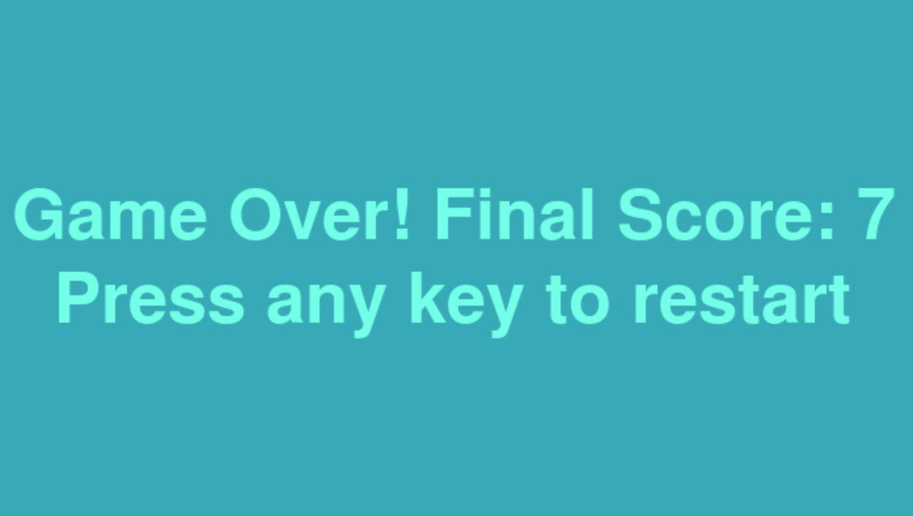

# Snake Game


An implementation of the famous Snake Game written in Python using the Pygame library.
The application can be used with your favourite game music via the pygame.mixer module.

The code initializes Pygame and sets up the game window using ```pygame.display.set_mode()``` based on dimensions specified in ```config.SCREEN_SIZE```. To control the game's framework, a clock object ```clock``` is created and the game's state is continuously updated in the main loop ```while running```. Keyboard inputs control the snake's direction, with constraints to prevent reversing the snake's movement immediately and the loop also checks for quit events and escape key press to exit the game.

```pygame.display.flip()``` updates the full display window to show changes, and ```clock.tick(config.FPS)``` ensures the game runs at a consistent frame rate.

## Installation

1. Clone the repository:
   ```bash
   git clone https://github.com/tpreisig/snake-game.git
   ```
2. Navigate to the directory:
   ```bash
   cd snake-game
   ```
3. Set up a virtual environment and activate it:
   ```bash
   python3 -m venv venv
   source venv/bin/activate
   ```
4. Install the Pygame library:
   ```bash
   pip install pygame-ce
   ```
## Usage

To start the application, run the command:
```bash
python3 -m game
```
## License

This project is licensed under the MIT License - see the [LICENSE](LICENSE) file for details.

## Visuals




## Contact

Maintained by tpreisig - feel free to reach out!

